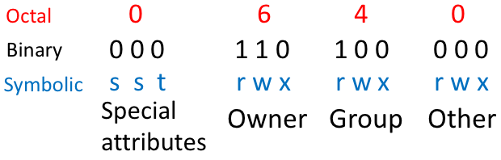
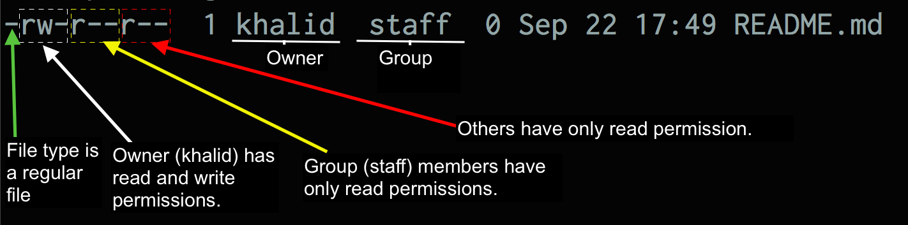

### The UNIX/Linux Filesystem

> The purpose of a filesystem is to organize the system's storage resources.


### Filesystem main components

 1. A namespace: How to name things and organize them in a hierarchy
 2. An API: a set of system calls for manipulating things
 3. Security models: schemes for protecting, hiding, and sharing things
 4. An implementation: software that talks to the underlying hardware


 ### The Linux kernel supports many different types of filesystems:
 
  - _ext4_, the predominant type
  - _XFS_
  - _UFS_
  - Non-Linux filesystems: _FAT_ and _NTFS_


### Pathname
- A pathname refers to the route to a unique location in the tree structure of the filesystem. The pathname can be described as:
  - Absolute pathname: starts with a slash on the left, e.g. /etc/passwd
  - Relative pathname: does not start with a slash. It's relative to the present working directory (pwd) e.g. etc/passwd

```bash
$ /home/khalid/scripts/bash/script.sh ## absolute pathname
$ cd /home/khalid/                    ## absolute pathname
$ scripts/bash/script.sh              ## relative pathname
```


### Mounting and Unmounting
- External storage media devices can be mounted in any directory created by the user.
  - Typically in `/mnt/`
- The `mount` command is used to mount a device and `umount` to unmount it.

```bash
$ mount /dev/cdrom /mnt/cdrom
$ umount /mnt/cdrom
```


### Organization of the file tree
| Pathname        | Contents           |
| --------------- |--------------------|
|   /bin   and /sbin       |    Core Operating system commands.                |
|    /boot             |    Boot loader and files needed by the kernel.                |
|    /dev             |   Device entries for disks, printers, etc.                |
|     /home            |  Default home directories for users.                  |
| /root | The home directory for the root user (sometimes just /).  |


| Pathname        | Contents           |
| --------------- |--------------------|
|      /lib           |    Libraries, shared libraries, and commands used by /bin and /sbin
|   /mnt             | Temporarily mount points for removable media. |
|   /tmp              |     Temporarily files that disappear after reboot.               |
| /user | Hierarchy of secondary files and commands (/usr/bin, /usr/lib, etc.). |
| /var | System-specific data and configuration files. |


### File types (I)
- Linux uses a symbol to indicate the file-type.
- The symbol is the first 

```bash
$ ls -l
total 4
-rw-r--r--  1 khalid  staff    0 Sep 22 17:49 README.md
drwxr-xr-x  6 khalid  staff  204 Sep 22 16:59 content
drwxr-xr-x  4 khalid  staff  136 Aug 28 22:36 static
drwxr-xr-x  3 khalid  staff  102 Aug 28 22:36 themes
```


### File types (II)
| File Type | Symbol |
|-----------|--------------------|
| Regular file | - |
| Directory | d |
| Hard link | c |
| Character and block device files | b |
| Socket | s |
| Named pipe | p |
| Symbolic link | l |


### File Access Attributes
- Every file has a set of nine bits called permission bits to control who can read, write, or execute the content of the file.
- The permissions are distributed into three user catergories: user owner (_u_), users in the same group (_g_), and all other users (_o_).
- Permission bits are represented in binary, octal, or character symbols.
- Each permission may be 'on' or 'off' for each of the three categories of users: owner, group, and other.


### File Access Attributes (Cont.)



### Inspecting files using ls
```bash
$ ls -l my-script.sh
-rwxr-xr--  1 khalid  staff  0 Sep 22 17:49 my-script.sh
```
- There are read (_r_), write (_w_), and execute (_x_) permissions. 
- The symbol _-_ indicates the permission is turned off.



###### Numerical Representation
| Numerical | letter | Meaning |
|--|----|-------------------------|
| 7| rwx| read, write, and execute|
| 6| rw-| read and write|
| 5| r-x| read and execute|
| 4| r--| read-only|
| 3| -wx| write and execute|
| 2| -w-| write only|
| 1| --x| execute only|
| 0| ---| none


### Changing permissions using chmod

```bash
# Everybody has full access:
$ chmod 777 main.java
# Owner has full access:
$ chmod 700 main.java
# Owner has full access, group members have read-only access:
$ chmod 740 main.java
```

```bash
# All users have read and write access:
$ chmod a=rw main.java
# User has read and write access:
$ chmod u=rwx main.java
# Group members have read access:
$ chmod g=r main.java
```

```bash
# Add the execute (x) permission to the user:
$ chmod u+x main.java
# Deny the execute (x) permission from the user:
$ chmod u-x main.java
```


### Changing file owner and group using chown

```bash
# changing the owner of a file
$ sudo chown ali main.java 
# changing the owner of a directory
$ sudo chown ali ./src/
# changing the owner of a directory and its subdirectories
$ sudo chown -R ali ./src/
```

```bash
# changing the owner and group of a file
$ sudo chown root:staff main.java
# changing the owner and group of a directory
$ sudo chown root:staff ./src
# changing the owner and group of a directory 
#          and its subdirectories
$ sudo chown -R root:staff ./src/
```
