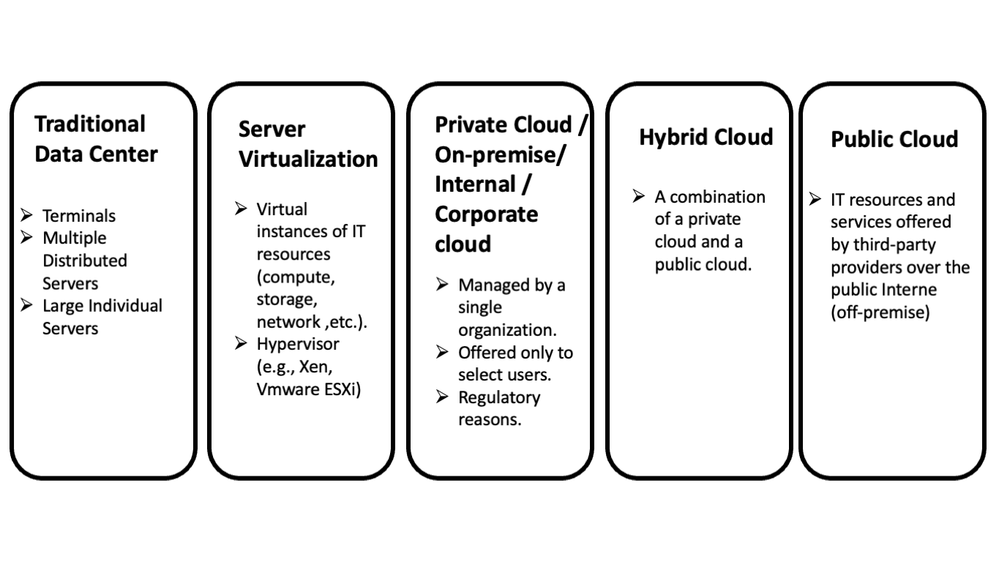
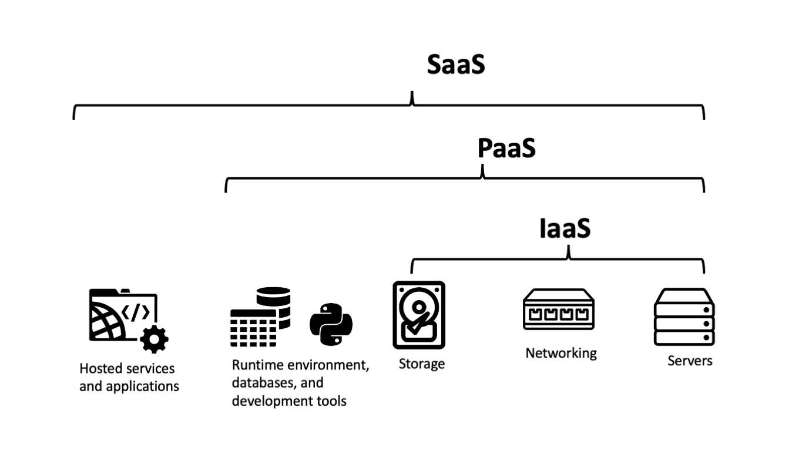
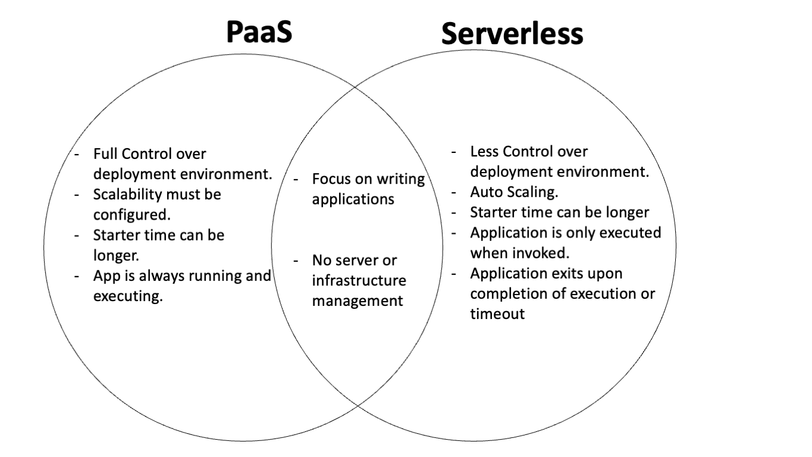

## Agenda
- What's Cloud Computing
- Evolution of Cloud Computing
- Cloud Deployment Models
- Cloud Service Models

## What's Cloud Computing?

"Cloud computing is a model for enabling ubiquitous, convenient, on demand network access to a shared pool of configurable computing resources (e.g., networks, servers, storage, applications, and services that can be rapidly provisioned and released with minimal management effort or service provider interaction."

[The NIST Definition of Cloud Computing \(NIST Special Publication 800\-145\)](https://csrc.nist.gov/publications/detail/sp/800-145/final)

## The evolution of Cloud Computing
 

## Cloud Deployment Models
- Private Cloud
- Community Cloud
- Public Cloud
- Hybrid Cloud

## Private cloud
- An internal cloud that's hosted on-premises and owned by a single organization.
- Pros:
  - Full control over management and data
  - Controlled level of security
  - Controlled level of privacy

## Private cloud (cont.)
- Cons:
  - Complex and expensive operations and maintenance costs.
  - Security depends on staff expertise
  - Slow integration and restricted access

## Community Cloud
- A cloud that's shared among multiple organizations in a shared community.
Examples: research labs, health care companies, financial companies, etc.
- Pros:
  - Controlled level of security and privacy.
  - Meeting regulatory compliance requirements.
  - Cost may be shared among participants.
- Cons:
  - Very similar to the limitations of private clouds.

## Public Cloud 
- A cloud that's hosted and owned by a 3-rd party, cloud provider.
- Examples: AWS, Azure, GCP
- Pros:
  - Scalability
  - Lower costs
  - Enterprise-level support
  - Faster integration
  - Upgrades and maintenance

## Public Cloud (cont.)
- Pros:
  - On-demand access to resources
  - Security and reliability
- Cons:
  - Privacy and regulatory compliances

## Hybrid Cloud
- A cloud that combines a private or on-premise cloud with a public cloud.
- Pros:
  - Cost effective
  - Regulatory compliances
  - Full control over sensitive assets.
- Cons:
  - Security depends on staff expertise
  - Integration between clouds introduces additional complexity

## Characteristics of Cloud Computing
- On-demand Self Service
- Broad network access
- Reserve Pooling
- Rapid Elasticity
- Measured Service

## Cloud Service Models
- Software as a Service (SaaS)
- Platform as a Service (PaaS)
- Infrastructure as a Service (IaaS)
- Serverless

## Software as a Service (SaaS)
- A software that can be used over the Internet.
- SaaS represents a complete solution where all underlying infrastructures, runtime environments, and storage are managed by the provider.
- The service provider manages the hardware, software, availability, security, and provides support to their users.

## Software as a Service (SaaS) (Cont.)
- Use complex enterprise applications without the need to install, update, or maintain any hardware, or software.
- Access and run the software anywhere on client applications.
- Custom purchase options: subscription, pay-as-you-go, etc.
- Examples: Gmail, Microsoft Office 365, Blackboard, etc.

## Platform as a Service (PaaS)
- A complete development and production environment that provides network, storage, compute, and runtime resources to the consumer's application.
- Out of the box development framework
- Create applications using built-in software components to reduce coding and shipping time.

## Platform as a Service (PaaS) (Cont.)
- Develop and ship applications without adding staff (e.g., Site-reliability/DevOps engineers).
- Fully integrated environment for building, testing, deploying, managing, and updating applications.
- Examples: Heroku, Google App Engine, AWS elastic beanstalk, and Azure App Service.

## Infrastructure as a Service (SaaS)
- Low level cloud computing solution that offers provisioning compute, storage, and networking resources on a pay-as-you-go basis
- Offers the flexibility to scale the required resources up and down to meet demands.
- Install, configure, and manage your own infrastructure including compute, storage, networking, operating systems, middleware, and applications.
- Examples: Amazon AWS, Microsoft Azure, and Google GCP.

## Serverless
- The cloud provider automatically provisions, scales, and manages the infrastructure required to run your application.
- Despite the name, servers are still running the code.
- Tasks to provision, scale, and manage the infrastructure are invisible to the developer.

## Serverless (cont.)
- Usage-based payment model
- No infrastructure management and dynamic scalability.
- Scaling is instant, automatic, and on demand
- Examples: AWS Lambda, Azure functions, and Google Cloud Function

## PaaS vs Serverless

## Cloud Computing Concepts
Key concepts in cloud computing and data centers

## Regions and Availability Zones
- **Regions:** A region is a physical location around the world where data centers are clustered in multiple physically isolated groups called availability zones.
- **Availability Zones (AZs):** An Availability Zone (AZ) is one or more discrete data centers with redundant power, networking, and connectivity in a region.

## Edge Networks
- **Global Services (Edge Networks)**: Edge locations are connected to the the regions through the low-latency network backbone that circles the globe.

## Cloud Computing Concepts

## Auto-scaling and portable environments
- Auto-scaling: Scale out/up and in/down automatically.
- This solves poor capacity decisions such as over-provisioning and under-provisioning.
- Testing environment
  - Create identical testing and production environments
  - Automate your tasks
- Automate your workloads

## Infrastructure as Code (IaC)
- Manage and provision your infrastructure in a descriptive model.
  - Infrastructure as Code (IaC): AWS Cloud Formation, Terraform.
  - This will speed up reconstruction in the event of a failure.

## Infrastructure as Code (IaC) (cont.)
  - IaC allows you to compose your large deployment that consists of multiple components in JSON template and covert them into an infrastructure (called stacks) and create multiple copies from your deployment

## Example: Terraform with Azure

<section>
  <pre><code data-trim data-noescape>

resource "random_pet" "rg_name" {
  prefix = var.resource_group_name_prefix
}

resource "azurerm_resource_group" "rg" {
  location = var.resource_group_location
  name     = random_pet.rg_name.id
}

# Create virtual network
resource "azurerm_virtual_network" "my_terraform_network" {
  name                = "myVnet"
  address_space       = ["10.0.0.0/16"]
  location            = azurerm_resource_group.rg.location
  resource_group_name = azurerm_resource_group.rg.name
}

# Create subnet
resource "azurerm_subnet" "my_terraform_subnet" {
  name                 = "mySubnet"
  resource_group_name  = azurerm_resource_group.rg.name
  virtual_network_name = azurerm_virtual_network.my_terraform_network.name
  address_prefixes     = ["10.0.1.0/24"]
}

# Create public IPs
resource "azurerm_public_ip" "my_terraform_public_ip" {
  name                = "myPublicIP"
  location            = azurerm_resource_group.rg.location
  resource_group_name = azurerm_resource_group.rg.name
  allocation_method   = "Dynamic"
}

# Create Network Security Group and rule
resource "azurerm_network_security_group" "my_terraform_nsg" {
  name                = "myNetworkSecurityGroup"
  location            = azurerm_resource_group.rg.location
  resource_group_name = azurerm_resource_group.rg.name

  security_rule {
    name                       = "SSH"
    priority                   = 1001
    direction                  = "Inbound"
    access                     = "Allow"
    protocol                   = "Tcp"
    source_port_range          = "*"
    destination_port_range     = "22"
    source_address_prefix      = "*"
    destination_address_prefix = "*"
  }
}

# Create network interface
resource "azurerm_network_interface" "my_terraform_nic" {
  name                = "myNIC"
  location            = azurerm_resource_group.rg.location
  resource_group_name = azurerm_resource_group.rg.name

  ip_configuration {
    name                          = "my_nic_configuration"
    subnet_id                     = azurerm_subnet.my_terraform_subnet.id
    private_ip_address_allocation = "Dynamic"
    public_ip_address_id          = azurerm_public_ip.my_terraform_public_ip.id
  }
}

# Connect the security group to the network interface
resource "azurerm_network_interface_security_group_association" "example" {
  network_interface_id      = azurerm_network_interface.my_terraform_nic.id
  network_security_group_id = azurerm_network_security_group.my_terraform_nsg.id
}

# Generate random text for a unique storage account name
resource "random_id" "random_id" {
  keepers = {
    # Generate a new ID only when a new resource group is defined
    resource_group = azurerm_resource_group.rg.name
  }

  byte_length = 8
}

# Create storage account for boot diagnostics
resource "azurerm_storage_account" "my_storage_account" {
  name                     = "diag${random_id.random_id.hex}"
  location                 = azurerm_resource_group.rg.location
  resource_group_name      = azurerm_resource_group.rg.name
  account_tier             = "Standard"
  account_replication_type = "LRS"
}

# Create (and display) an SSH key
resource "tls_private_key" "example_ssh" {
  algorithm = "RSA"
  rsa_bits  = 4096
}

# Create virtual machine
resource "azurerm_linux_virtual_machine" "my_terraform_vm" {
  name                  = "myVM"
  location              = azurerm_resource_group.rg.location
  resource_group_name   = azurerm_resource_group.rg.name
  network_interface_ids = [azurerm_network_interface.my_terraform_nic.id]
  size                  = "Standard_DS1_v2"

  os_disk {
    name                 = "myOsDisk"
    caching              = "ReadWrite"
    storage_account_type = "Premium_LRS"
  }

  source_image_reference {
    publisher = "Canonical"
    offer     = "UbuntuServer"
    sku       = "18.04-LTS"
    version   = "latest"
  }

  computer_name                   = "myvm"
  admin_username                  = "azureuser"
  disable_password_authentication = true

  admin_ssh_key {
    username   = "azureuser"
    public_key = tls_private_key.example_ssh.public_key_openssh
  }

  boot_diagnostics {
    storage_account_uri = azurerm_storage_account.my_storage_account.primary_blob_endpoint
  }
}
 </code></pre>
</section>

## General Cloud Design Principles
- Anticipate failure: Instead of treating failure as an unusual event, it should be considered as a normal operational event.
- Design for resiliency: Resiliency needs to be used in all layers of architecture: infrastructure, application, database, security, and networking.

## High Availability vs. Fault Tolerance
- Design high availability and fault tolerant solution:
  - Availability refers to the percentage uptime of a particular resource in 9s.
  - High Availability means the system is up and available, but it might perform in degraded state.
- Fault tolerance is a higher version of High Availability and means the system will continue to function without degradation in performance despite the complete failure of component(s).

## High Availability and Fault Tolerance Example
- Consider a system with an application that requires six VM instances to handle the expected load.
- Highly available:
  - It has several virtual machine instances running in two different AZs.
  - e.g., six servers across two AZs with three instances in one AZ.

## High Availability and Fault Tolerance Example (cont.)
- Fault Tolerant:
  - It still has six running instances, even if one AZ goes down.
  - e.g., nine instances in total running across three AZs

## Common Application Availability Design Goals
| Availability %   | Downtime per year  | Application Categories  |
|---|---|---|
| 90% ("one nine")   | 36.53 days   |   |
| 99% ("two nines")   |   3.65 days  | Batch processing, data extraction, and load jobs  |

| Availability %   | Downtime per year  | Application Categories  |
|---|---|---|
| 99.9% ("three nines")   |   8.77 hours |   Internal tools like knowledge management and project tracking|
|  99.99% ("four nines")  |  52.60 minutes  |  Point of sale |

| Availability %   | Downtime per year  | Application Categories  |
|---|---|---|
|  99.999% ("five nines")  | 5.26 minutes   |  Video delivery, broadcast workloads |
|  99.9999% ("six nines")  |  31.56 seconds  | ATM transactions, telecommunication workloads  |

## Availability Design Goal Example: 99%
- 30 minutes to understand and decide how to execute recovery.
- Deploy the whole stack in IaC in 10 minutes, assume that we deploy to a new Availability Zone, and assume that the database can be restored in 30 minutes. 
  - In total, that's 70 minutes to recover from a failure. 

  - One failure per quarter => 280 minutes per year (four hours and 40 minutes).
  - The upper limit on availability is 99.9%
- Add offline maintenance and updates:
  - four hours per change, six times per year = 24 hours per year.
- In total, the availability design goal is now at 99%

## Disaster Recovery (DR)
- A good resiliency strategy should also include Disaster Recovery (DR) objectives based on strategies to recover your workload in case of a disaster event.
- Your disaster recovery should include both Recovery Time Objective (RTO) and Recovery Point Objective (RPO).

## Recovery Time Objective (RTO)
- Recovery Time Objective (RTO): How long does it take you to recover and bring the system back online after a failure? 
  - It's measured in seconds

## Recovery Point Objective (RPO)
- Recovery Point Objective (RPO): How much data is lost if the system fails? 
  - It's measured in data units (e.g., 10 GB) or time (e.g., 1 hour worth of data).

# Takeaway Lessons

> Eliminate single points of failure

> With great complexity comes great responsibility

> Set expectations! 

## More on the three takeaways! 
- Building for high availability comes down to a series of tradeoffs.
- Think of complexity vs. simplicity
- Avoid over-engineering
- Analogy: a set of concrete steps vs. an escalator
  - We can't build an escalator with the same uptime as stairs
- Think of complexity vs. availability