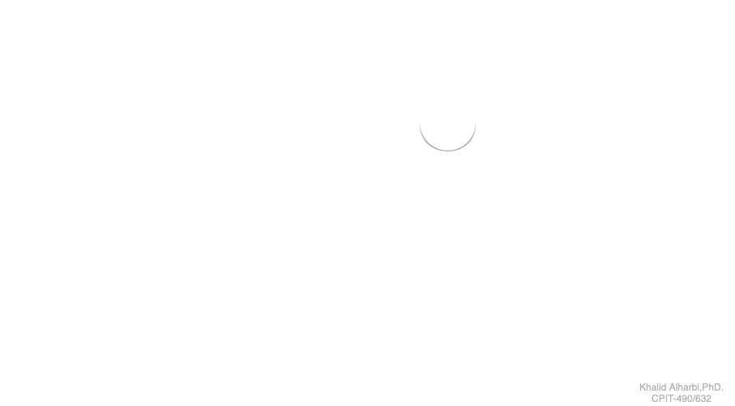
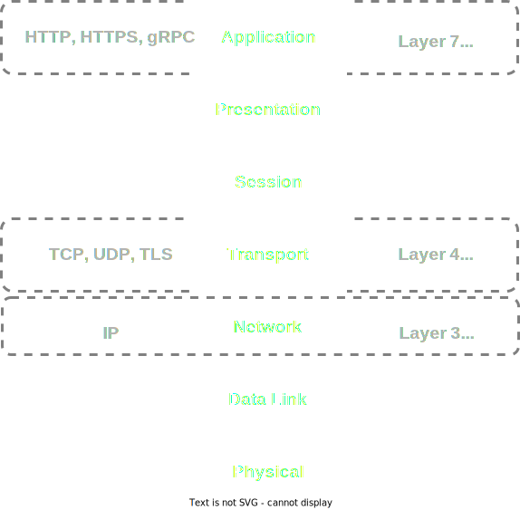
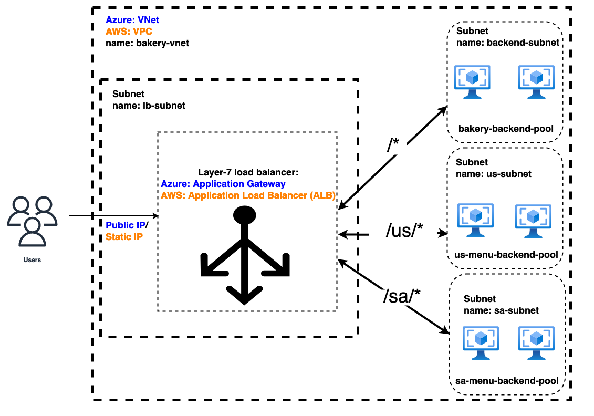

## Agenda

- Networking on the cloud
  - VPCs and Subnets
  - Routing, Peering, and Network Interfaces
  - NAT Gateways and WAF
- Single-server design
- Load balancing
- Load balancer types
- Application load balancer demo

Before we talk about distributed systems and server pools, we need to understand key terms in networking on the cloud.

While these terms may vary among cloud providers, we will use the terms used by the three major cloud providers: AWS, Azure, and GCP.

# Cloud Networking Terms

## VPCs and Subnets
- Virtual Private Cloud (VPC)
  - Logically isolated virtual network in a separate section of the cloud for launching resources.
  - Both AWS and GCP call this "VPC", while Azure calls it "VNet" (Virtual Network).
- Subnet
  - Is a logical subdivision of an IP network that can be private or public.
  - AWS, Azure, and GCP call this "subnet".

## Routing and Peering
- Network Routes/Routing 
  - A set of rules that are used to determine where network traffic from subnets and/or gateways are directed.
- Network Peering
  - A networking connection between two VPCs that enables the routing traffic between them using private IP addresses.
    - AWS: VPC Peering Connections. Azure: Virtual Network Peering. GCP: VPC Network Peering.

## Network Interface
- A logical networking component in a VPC that represents a virtual network card.
- It enables a VM instance to communicate with the Internet, VPC, and on-premise resources.
- It may have private IPv4 address, public IP address, a MAC address, and one or more IPv6 addresses.
- It can be attached/added to a VM or detached/removed from a VM. 

## NAT Gateway
- A Network Address Translation (NAT) service that allows instances in a private subnet to connect to services outside the VPC while external services are not allowed to initiate a connection to services inside a private network. 
- Enables outbound internet traffic from instances in a private subnet.
- Useful when instances in a private subnet need to reach the public Internet for software updates but do not want to be publicly accessible.

## Web Application Firewall (WAF)
- A reverse-proxy that forces clients to pass through the WAF before reaching the server.
- Helps mitigate many common attacks and vulnerabilities.
- Creates a shield between a web app and the public Internet
- It can be also used to block requests from a specific country or geolocation
- Examples: ModSecurity, AWS WAF, Azure WAF, GCP Cloud Armor, and Cloudflare WAF.

## Single-server Design
- We can't run a highly available website or an app on a single server.
  - It is a single point of failure (SPOF).
  - We can't update our application, host OS, or configuration without downtime.
  - It is vulnerable to load spikes and attacks (e.g., DoS).
  - It will eventually become crippled when there's an overflow of requests.

## Load Balancing (I)

- A load balancer is a form of proxy server that distributes incoming network traffic across a group of downstream web servers (commonly known as server pool or server farm).
-  The server pool can be VM instances, containers, scale set, serverless functions, or IP addresses
- A load balancer also monitors the health and status of the server pool to ensure availability and timely response.

## Load Balancing (II)

## Load Balancing (III)
- A load balancer (LB) does not process incoming requests but routes them to other systems.
- If a server is not responding, it will detect this problem, stop directing traffic to that server, and remove it from the server pool.
  - This is done through the "health-check" mechanism.

## Load Balancing (IV)
- Load balancers can be hardware-based or software-based.

## Hardware Load Balancers
- A hardware LB uses a proprietary device/appliance and a specialized operating system to distribute traffic across multiple servers.
  - can be scaled by purchasing bigger appliances from the vendor.
  - over-provisioned to handle larger requests.
  - more expensive and less flexible.

## Software Load Balancers
- A software LB uses Software solutions that run on commodity hardware.
  - can be installed on almost any VM or computer architecture.
  - scale elastically to meet demand.
  - less expensive and more flexible.

## Load Balancers Availability
- A load balancer itself can become a SPOF unless you:
  - Have two LBs, one serving traffic and one running as a passive backup.
  - Have two LBs, serving traffic simultaneously.
  - Use a fully-managed load balancer that automatically distributes your incoming traffic across multiple targets, with an SLA of at least 99.99%.

## Benefits of Load Balancing
- High Availability
- Scalability
- Redundancy
- Flexibility
- Efficiency
- Security

### Commonly Used Load Balancing Algorithms

- **Round Robin**
  - Requests are distributed across a group of servers sequentially in a fixed order.
- **Load equalization/Least Time**
  - New requests go to the server that's handling the least requests or connections.
- **Partitioning/IP Hash**
  - The hash of the client's IP determines which server handles the request.

## Types of Load Balancers (I)

## Types of Load Balancers (II)

A load balancer may function at the 7th, 4th, or 3rd layer the Open Systems Interconnection (OSI) model:

- Layer-7 Load Balancer: Application Load Balancer
- Layer-4 Load Balancer: Network Load Balancer
- Layer-3 Load Balancer: Gateway Load Balancer

### Application Load Balancer (ALB)
- Layer 7 load balancer that distributes incoming traffics across multiple targets.
- Targets can be VM instances, containers, IP addresses, or serverless functions.
- Support for HTTP header conditions and methods, URL path, query parameters, and source IP addresses.
- Protocol listeners: HTTP, HTTPS, and gRPC

## Application Load Balancer (ALB) (Cont.)
- ALB supports (SSL/TLS) termination at the ALB.
  - Traffic flows encrypted to the ALB and then flows unencrypted to the backend servers. 
  - This improves performance and free the servers from costly encryption and decryption overhead.
- If security compliance requires end to end SSL/TLS encryption, encrypted communication to the servers can be also configured at the ALB.

### Application Load Balancers (ALBs) for Linux
- The most common load balancers for Linux are:
 - [nginx](https://nginx.org/en/docs/http/load_balancing.html)
 - [HAProxy](http://www.haproxy.org/)

 [Apache httpd](https://httpd.apache.org/docs/2.4/mod/mod_proxy_balancer.html) also has a load-balancing module although it's not as widely used as nginx and HAProxy.

## Fully-managed Application Load Balancers (ALBs)
- AWS has a suite of load balancers called Elastic Load Balancer, which has an Application Load Balancer (ALB).
- GCP has a suite of load balancers called Google Cloud Load Balancing that has an HTTP Load Balancers.
- Azure's ALB is called Application Gateway.

## Application Load Balancer Features
- Secure Sockets Layer (SSL/TLS) termination
- Autoscaling
  - scale-up/scale-out or scale-in/scale-down based on changing traffic load patterns.
-  Multiple availability zone (AZ) redundancy.
- Static virtual IP address
- Web Application Firewall

## Application Load Balancer Features (Cont.)
- URL-based routing
  - requests for _http://example.com/video/*_ are routed to the _VideoServerPool_, and _http://example.com/images/*_ are routed to the _ImageServerPool_.

## Application Load Balancer Features (Cont.)
- Host-based routing
  - requests for _http://sa.example.com_ are routed to the _SAServerPool_, and _http://us.example.com_ are routed to the _USServerPool_.
  - requests for _http://example.sa_ are routed to the _SAServerPool_, and _http://example.us_ are routed to the _USServerPool_.

## Application Load Balancer Features (Cont.)
- More routing features
  - redirect HTTP requests to HTTPS
  - redirect from and to any port
  - redirect to an external site
- Sticky sessions
  - bind a user's session to a specific target
- Authenticate users
  - securely authenticate the client sending requests.

## Application Load Balancer Features (Cont.)
- Connection Draining
  - give all in-progress requests time to complete when a VM is removed from the pool or server updates.
- Custom error pages
   - 403 web application firewall error when WAF detects malicious traffic and blocks it
   - 502 maintenance page when there's no backend server to route to.

## Types of Load Balancers (II)

- Layer-7 Load Balancer: Application Load Balancer
- Layer-4 Load Balancer: Network Load Balancer
- Layer-3 Load Balancer: Gateway Load Balancer

### Network Load Balancer (NLB)
- Layer 4 load balancer that distributes incoming traffics across multiple targets based on the source and destination IP addresses and ports available in the packet header, without considering the contents of the packets.
- Targets can be VM instances, containers, or IP addresses.
- Supports ultra high performance with million of requests per second, low latency, and TLS offloading at scale.

### Network Load Balancer (NLB) (cont.)
- Protocol listeners: TCP, UDP, and TLS
- After a TCP network load balancer receives a connection request, it selects a target and attempts to open a TCP connection to the selected target on the port specified in the listener configuration.
- Examples: AWS Network Load Balancer and Azure Load Balancer.

## Types of Load Balancers (II)

- Layer-7 Load Balancer: Application Load Balancer
- Layer-4 Load Balancer: Network Load Balancer
- Layer-3 Load Balancer: Gateway Load Balancer

### Gateway Load Balancer (GLB)
- Layer 3 load balancer
- used for managing and scaling virtual appliances such as firewalls and intrusion detection systems.
- Protocol listeners: IP
- Targets can be IP or VM instances.
- It is deployed in the same VPC as that of the virtual appliances.

### Gateway Load Balancer (GLB) (Cont.)
- It listens for all IP packets across all ports and forwards traffic to the target group that's specified in the listener rule.
- It provides private connectivity between virtual appliances in the service provider VPC, and application servers in the service consumer VPC.
- Examples: AWS is the only provider that has a layer-3 LB called Gateway Load Balancer.

### Summary of Load Balancer Types
- **Layer-3 LB** takes routing decisions based on <u>IP addresses</u> alone (source & destination).
- **Layer-4 LB** takes routing decisions based on <u>IP addresses</u> and <u>TCP or UDP ports</u>.
- **Layer-7 LB** takes routing decisions based on <u>IP addresses</u> and <u>TCP or UDP ports</u>, and the <u>content of the request</u> (URL, HTTP headers or cookies).

## Application Load Balancer Example

- We will use a fictional [bakery API server]() that has the following endpoints:

  - `/us/menu`: returns the US menu of the bakery store.
  - `/sa/menu`: returns the SA menu of the bakery store.
  - `/health/`: A heartbeat endpoint for API health check. This is useful for the LB to check if the web server is running or not.
  - `/fatal`: for terminating the web server. This is useful for testing auto-scaling.

## Steps
1. Create a layer-7 load balancer. 
2. Create three backend pools.
3. Add target VMs into the backend pools.
4. Create a backend listener.
5. Configure the load balancer to use path-based routing rules to send incoming requests to the appropriate servers in the backend pools.

## Demo
